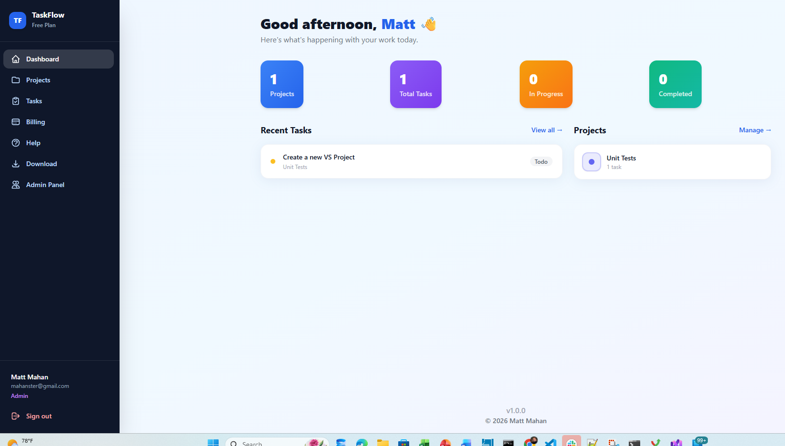
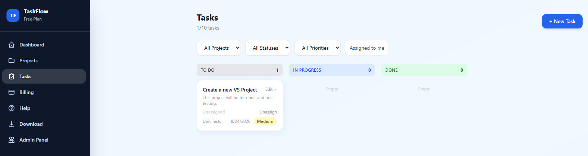
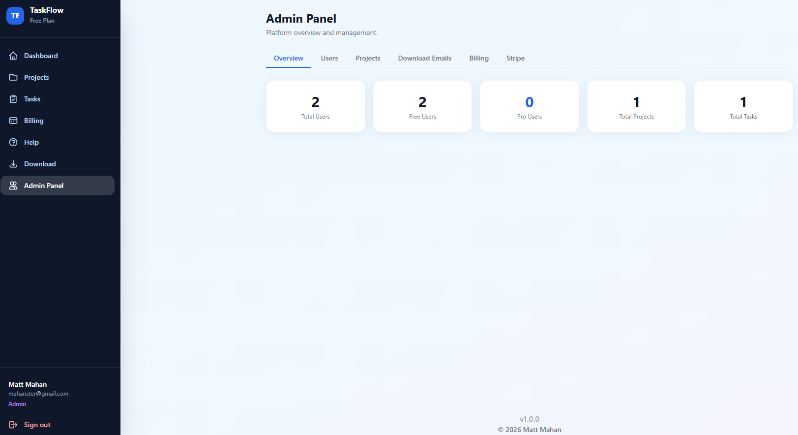
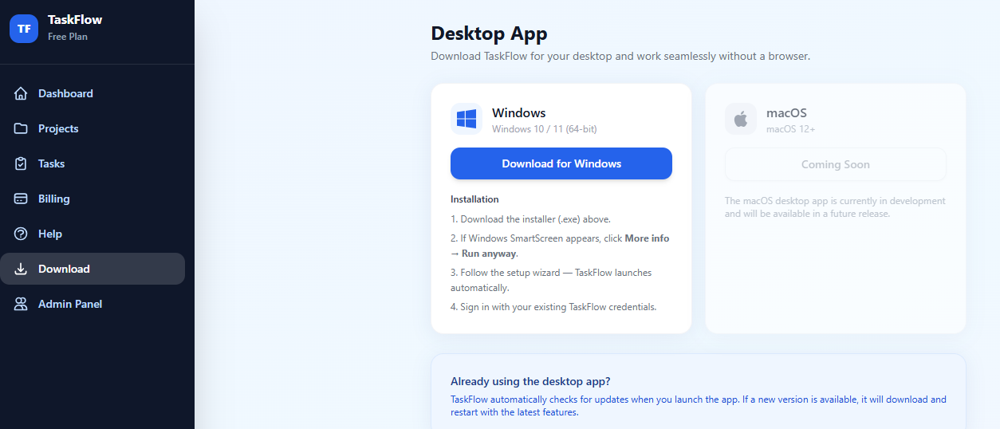

# TaskFlow

A full-stack SaaS task management application built to demonstrate production-grade software engineering across the entire stack — from database design and REST API development to React UI, cloud deployment, and third-party integrations.

**Live demo:** https://taskflow-web.azurewebsites.net

---

## Screenshots


*Dashboard — project and task summary with recent activity*


*Tasks — 3-column Kanban board (To Do / In Progress / Done)*


*Admin Panel — platform-wide stats and user management*


*Download page — Windows installer with installation instructions*

---

## Tech Stack

| Layer | Technology |
|-------|-----------|
| API | .NET 10 Web API, EF Core 10, BCrypt, JWT Bearer |
| Database | Azure SQL (SQL Server), EF Core Migrations |
| Frontend | React 19, TypeScript, Vite 8, Tailwind CSS v3 |
| Auth | JWT access tokens + refresh tokens, email verification (6-digit codes) |
| Payments | Stripe Checkout, webhooks, subscription management |
| Email | SendGrid transactional email |
| Hosting | Azure App Services (Linux) — separate API and Web instances |
| CI/CD | Azure DevOps Pipelines (build → deploy on push to main) |
| Desktop | Electron 42 wrapper (Windows) |
| Testing | xUnit + Moq + EF InMemory (API) · Vitest + React Testing Library (frontend) |

---

## Features

### Core Workflow
- **3-column Kanban board** — To Do / In Progress / Done
- Task creation with title, description, priority (Low / Medium / High), status, due date, and project assignment
- Task self-assignment — take or release ownership of any task

### Authentication & Accounts
- Email/password registration with SendGrid email verification (6-digit code)
- Forgot password / reset password via emailed code
- JWT access tokens with refresh token rotation
- Profile page — update name, change password

### Projects
- Unlimited projects per user, each with a name, description, and color swatch
- Per-project task count displayed on project cards

### Billing
- Free plan (10-task limit) and Pro plan ($9.99/mo, unlimited tasks)
- Stripe Checkout integration — secure hosted payment flow
- Stripe webhook handler for subscription lifecycle events
- Manual plan override available to admins (no Stripe required)

### Admin Panel
- Five-tab panel: Overview, Users, Projects, Download Emails, Billing, Stripe
- Platform stats — total users, free/pro split, total projects, total tasks
- Create, edit, and delete user accounts
- Toggle Admin role and manually override plan per user
- All projects across all users with owner info and task counts
- Send Windows download link email to any email address or existing user
- Stripe configuration reference — plan cards, webhook endpoint, Stripe Dashboard link

### Desktop App
- Electron wrapper for Windows — same React frontend in a native window
- Download page in the web app lets users grab the installer directly
- Auto-update support (checks Azure Blob Storage on launch)

### UX Details
- Portal-based tooltip system (top / bottom / left / right with arrow)
- Password visibility toggle on all password fields
- Contextual tooltips throughout — actions, priority badges, plan badges, stat cards
- Help page with User Guide and Admin Guide tabs
- v1.0.0 footer with version tooltip
- Dark sidebar with plan badge, Download link, and Help link

---

## Testing

### Backend — 24 tests (`dotnet test`)
- **AuthServiceTests** — register, duplicate email guard, login happy/error paths, email verification, expired codes, password reset, change password
- **AdminControllerTests** — stats counts, create user 201/409, edit name, delete 204/404, role toggle, plan downgrade clears Stripe subscription ID

### Frontend — 14 tests (`npm test`)
- **admin.service** — verifies correct API endpoints and payloads
- **DownloadPage** — renders heading, Windows link href, disabled Mac button, install steps, auto-update banner
- **LoginPage** — fields render, loading/disabled state, error banner, form submit calls login, clearError on input

---

## Architecture

```
TaskFlow/
├── TaskFlow.API/          # .NET 10 Web API
│   ├── Controllers/       # Auth, Tasks, Projects, Subscription, Admin
│   ├── Models/            # Request/response records
│   └── Services/          # AuthService, TokenService, SendGridEmailService
├── TaskFlow.Data/         # EF Core DbContext, Entities, Migrations
│   ├── Entities/          # User, Project, TaskItem, RefreshToken
│   └── Migrations/        # Full migration history with backfill SQL
├── TaskFlow.Tests/        # xUnit test project
│   ├── Controllers/       # AdminControllerTests
│   ├── Helpers/           # DbFactory (in-memory DB + TokenService setup)
│   └── Services/          # AuthServiceTests
├── TaskFlow.Web/          # React 19 + TypeScript frontend
│   └── src/
│       ├── components/    # Layout, ProtectedRoute, Tooltip, PasswordInput
│       ├── context/       # AuthContext (global auth state)
│       ├── pages/         # Dashboard, Tasks, Projects, Billing, Profile, Admin, Help, Download, Auth flows
│       ├── services/      # Axios-based API service layer
│       └── types/         # Shared TypeScript interfaces
└── TaskFlow.Electron/     # Electron desktop wrapper (Windows)
```

---

## Local Development

### Prerequisites
- .NET 10 SDK
- Node.js 22 LTS
- SQL Server (local) or Azure SQL
- SendGrid account (for email)
- Stripe account (for billing)

### API Setup
```bash
cd TaskFlow.API
# Create appsettings.Development.json with your local connection string,
# JWT secret, Stripe keys, and SendGrid API key (see appsettings.json for structure)
dotnet run
```

### Frontend Setup
```bash
cd TaskFlow.Web
npm install
npm run dev
```

The React app runs on `http://localhost:5173` and proxies API calls to `http://localhost:5028`.

### Running Tests
```bash
# Backend
dotnet test TaskFlow.Tests

# Frontend
cd TaskFlow.Web && npm test
```

### Database
EF Core migrations run automatically on API startup via `dbContext.Database.Migrate()`.

---

## CI/CD

Every push to `main` triggers an Azure DevOps pipeline that:
1. Builds the .NET 10 API and publishes a release artifact
2. Runs `npm run build` on the React frontend
3. Deploys the API to `taskflow-api.azurewebsites.net`
4. Wraps the React dist in a minimal Express static server and deploys to `taskflow-web.azurewebsites.net`
5. Applies EF Core migrations automatically on API cold start

Secrets (connection string, JWT secret, Stripe keys, SendGrid API key) are stored as encrypted Azure DevOps pipeline variables and injected as App Service environment variables at deploy time.

---

## About

Built by **Matt Mahan** — Software Architect with 15+ years of experience in .NET, React, and Azure.

- LinkedIn: https://www.linkedin.com/in/matt-mahan-usmc-veteran-611b646/
- Email: mahanster@gmail.com
